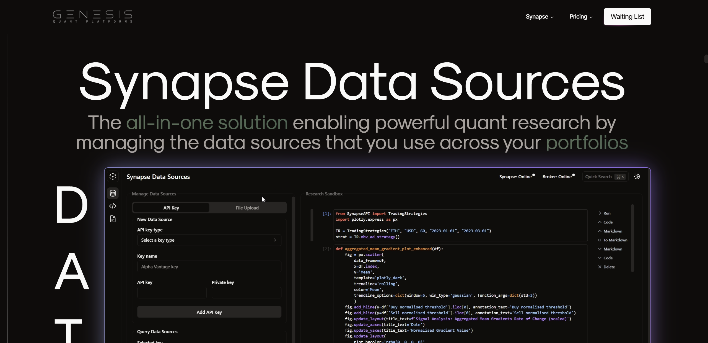

## :wave: About me

I'm a final-year Computer Science major at The University of British Columbia. I'm passionate about FinTech and Quantitative Finance. Feel free to contact me by email or via my socials!

[][linkedin]
[][email]

[linkedin]: https://www.linkedin.com/in/colin-lefter/
[email]: mailto:clefter@student.ubc.ca

 

## :globe_with_meridians: GitHub Stats

## 🛠️ Tools & Frameworks

## :dart: Top Skills

## :electron: Current Developments

### Genesis Quantitative Platforms

